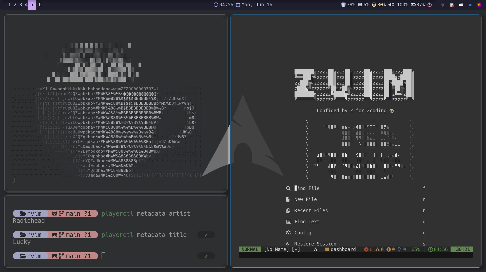
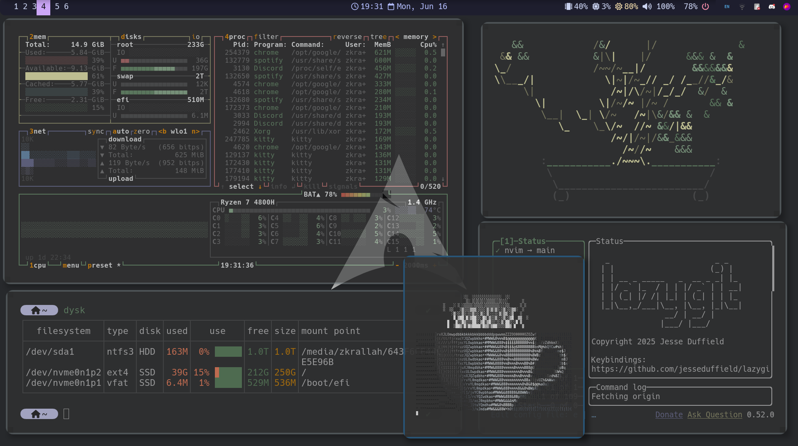
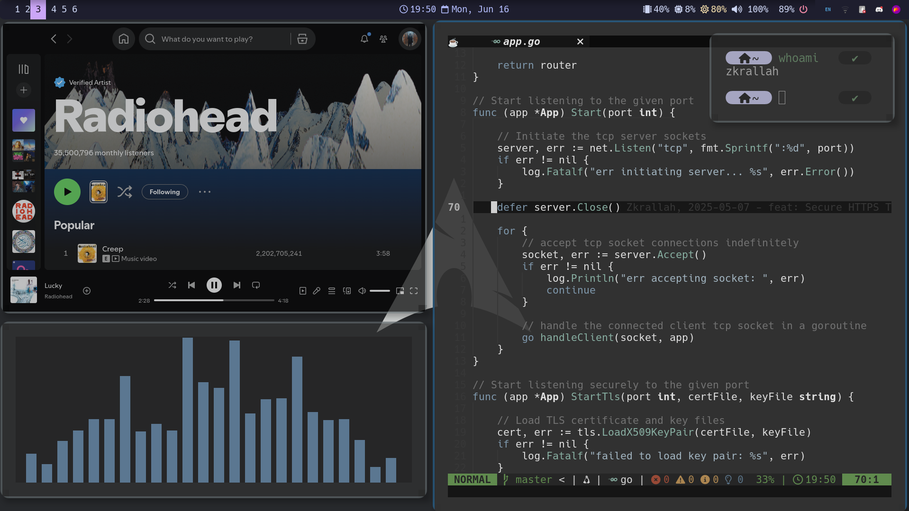
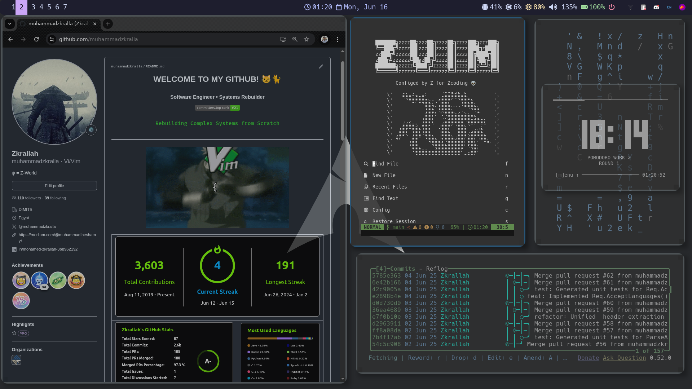
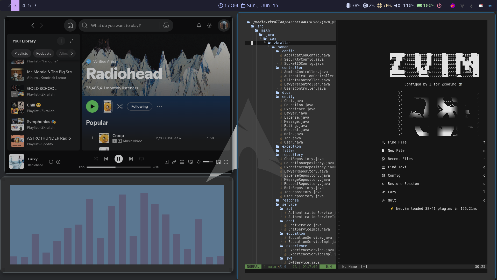
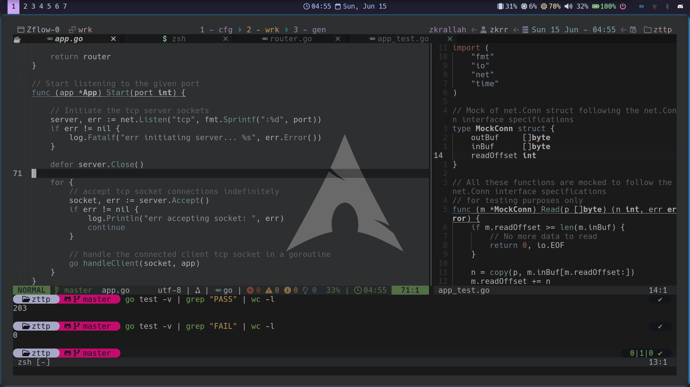
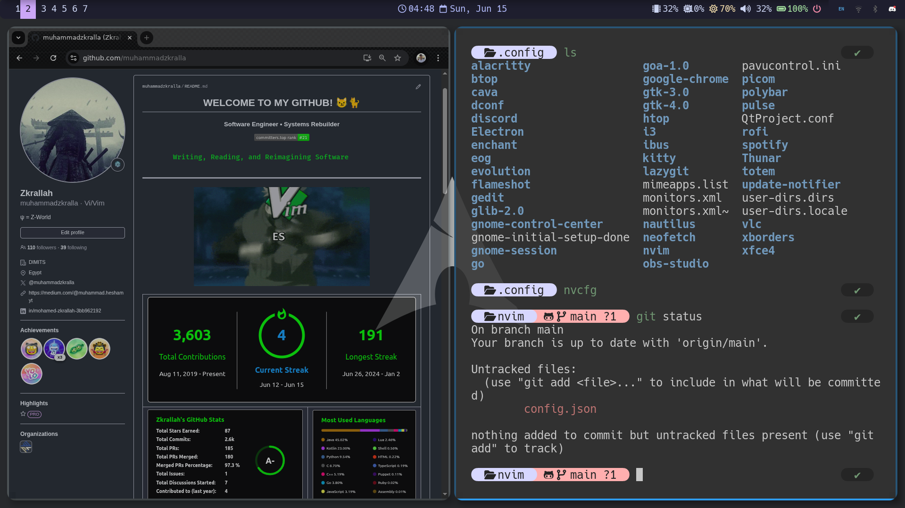

# Z Dotfilezzzzz

## Introduction

My Personal Snappy Cozy Yappy Linux Workflow Heavily Based on i3wm, kitty, tmux, zsh, neovim, and More CLIs for Maximum Coding Productivity Flow Sessions. 🥷🏔️

    -i3wm
    -kitty
    -tmux
    -zsh
    -nvim
    -picom
    -rofi
    -polybar
    -pavucontrol
    -lazygit

---
## Preview

 

 

 

 

 

 

 

